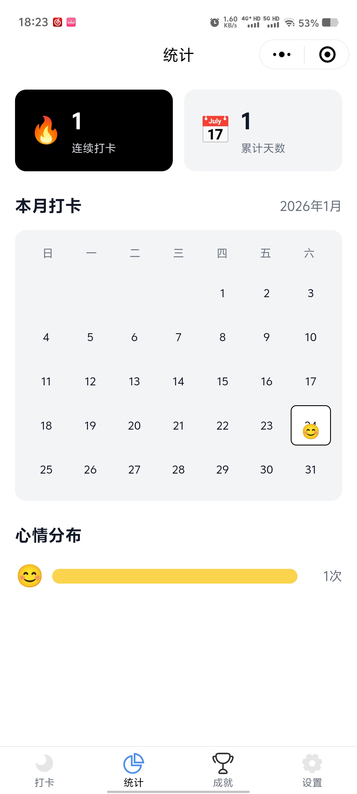
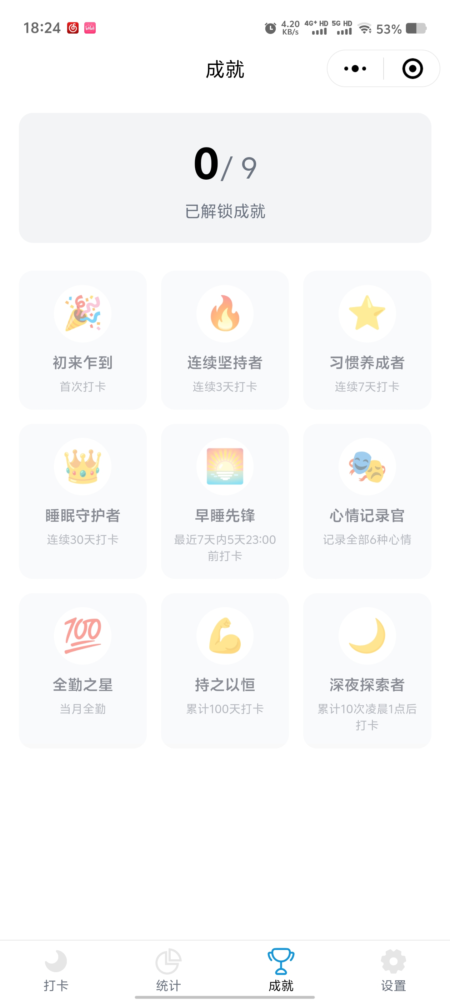

# 睡点儿 Sleep Point 💤

<div align="center">

**一款结合情绪记录与成就激励的极简睡眠追踪微信小程序**

[](https://uniapp.dcloud.io/)
[](https://mp.weixin.qq.com/)
[](https://cloud.tencent.com/product/tcb)

</div>

## ✨ 功能特性

### 🌙 核心功能
- **每日打卡** - 记录你的睡眠时刻，选择当日心情
- **情绪追踪** - 6种心情图标（高兴/满足/难过/疲惫/愤怒/担忧）
- **统计分析** - 连续打卡天数、本月日历视图、心情分布
- **成就系统** - 9种成就徽章，激励持续打卡
- **数据导出** - 支持导出打卡数据到剪贴板

### ☁️ 云开发特性
- **微信登录** - 获取用户信息，同步到云端
- **游客模式** - 无需登录即可使用，本地存储数据
- **云端同步** - 数据实时同步到腾讯云开发
- **跨设备访问** - 登录后可在多设备查看数据

### 🎨 设计亮点
- **极简风格** - 柔和配色，舒适易用
- **流畅动画** - 页面切换、成就解锁动效
- **响应式布局** - 适配各种屏幕尺寸

## 📱 功能截图

<div align="center">
  
  
  
</div>

## 🚀 快速开始

### 环境要求

- [HBuilderX](https://www.dcloud.io/hbuilderx.html) 3.0+
- [微信开发者工具](https://developers.weixin.qq.com/miniprogram/dev/devtools/download.html)
- Node.js 14+ (用于安装依赖)
- 微信小程序账号（AppID）

### 安装步骤

1. **克隆项目**
```bash
git clone https://github.com/Ginnam-maker/sleep_point.git
cd sleep_point/sleep_point
```

2. **安装依赖**
```bash
npm install
```

3. **配置 AppID**

编辑 [manifest.json](manifest.json)，填入你的微信小程序 AppID：
```json
{
  "appid": "your-appid-here",
  "mp-weixin": {
    "appid": "your-appid-here"
  }
}
```

> ⚠️ **重要**：需要在两个地方填入相同的 AppID（第3行和第54行）

4. **配置云开发（可选）**

如需使用云同步功能：
- 复制 `utils/cloud/config.example.js` 为 `utils/cloud/config.js`
- 编辑 `utils/cloud/config.js`，填入你的云环境 ID：
```javascript
export default {
  envId: 'your-cloud-env-id',
  enabled: true
}
```

5. **运行项目**

- 在 HBuilderX 中打开项目
- 点击 `运行` → `运行到小程序模拟器` → `微信开发者工具`
- 编译完成后，运行部署脚本（如需云开发）：
  ```powershell
  .\copy-cloudfunctions.ps1
  ```

6. **上传云函数（可选）**

在微信开发者工具中：
- 点击"云开发"按钮
- 依次右键 `checkin`、`unlockAchievement`、`updateCheckin` 云函数
- 选择"上传并部署：云端安装依赖"

## 📂 项目结构

```
sleep_point/
├── screenshots/              # 📱 项目截图（用于 README）
├── pages/                     # 页面文件
│   ├── index/                # 首页（打卡页）
│   ├── stats/                # 统计页
│   ├── achievement/          # 成就页
│   ├── settings/             # 设置页
│   ├── login/                # 登录页
│   └── share/                # 分享海报页
├── cloudfunctions/           # 云函数
│   ├── checkin/             # 打卡云函数
│   ├── unlockAchievement/   # 解锁成就
│   └── updateCheckin/       # 更新打卡
├── utils/                    # 工具函数
│   ├── index.js             # 通用工具
│   ├── storage.js           # 本地存储
│   ├── achievement.js       # 成就系统
│   ├── cloud/               # 云开发工具
│   │   ├── config.js        # 云配置
│   │   └── sync.js          # 数据同步
│   └── subscribe.js         # 订阅消息
├── static/                   # 静态资源
│   ├── tabbar/              # 导航栏图标
│   └── achievements/        # 成就图标
├── copy-cloudfunctions.ps1   # 云函数部署脚本
└── .gitignore               # Git 忽略配置
```

## 🎯 功能清单

### ✅ P0 核心功能（已完成）
- [x] 首页打卡（心情选择、防重复）
- [x] 统计页（连续天数、日历、心情分布）
- [x] 成就系统（9种成就、自动解锁）
- [x] TabBar 导航栏

### ✅ P1 增强功能（已完成）
- [x] 成就详情弹窗
- [x] 本月日历视图
- [x] 心情统计可视化
- [x] 随机助眠语录

### ✅ P2 辅助功能（已完成）
- [x] 设置页（提醒、数据导出）
- [x] 页面切换动画
- [x] 数据导出到剪贴板

### ✅ P3 云开发功能（已完成）
- [x] 微信登录 + 游客模式
- [x] 云数据库（users/checkins/achievements）
- [x] 云函数（打卡、成就、更新）
- [x] 数据云端同步
- [x] 分享海报生成

### 🚧 计划中功能
- [ ] 数据统计图表优化（修复布局）
- [ ] 订阅消息提醒（需申请模板）
- [ ] 入睡时间分析
- [ ] 睡眠质量评分
- [ ] 更多成就徽章

## 🛠️ 技术栈

- **框架**: uni-app (Vue 3)
- **云服务**: 腾讯云开发 CloudBase
- **UI**: 原生 CSS + 渐变动画
- **存储**: 本地存储 + 云数据库
- **图表**: @qiun/ucharts (待优化)

## ⚙️ 配置说明

### 1. 本地开发配置

无需云开发即可使用，数据存储在本地。

### 2. 云开发配置

如需云同步功能：

1. 在[腾讯云控制台](https://console.cloud.tencent.com/tcb)开通云开发
2. 创建云环境，获取环境 ID
3. 创建 3 个数据库集合：
   - `users` - 权限：仅创建者可读写
   - `checkins` - 权限：仅创建者可读写
   - `achievements` - 权限：仅创建者可读写
4. 为 `checkins` 集合添加索引（提高查询性能）：
   ```json
   { "_openid": 1, "date": 1 }  // 唯一索引
   { "_openid": 1, "timestamp": -1 }  // 普通索引
   ```
5. 上传云函数（见上方"快速开始"）

### 3. 环境变量说明

编辑 [utils/cloud/config.js](utils/cloud/config.js)：

```javascript
export default {
  envId: 'cloudbase-xxxxx',           // 云环境 ID
  enabled: true,                       // 是否启用云开发
  subscribeMessageTemplateId: ''       // 订阅消息模板 ID（可选）
}
```

## 📝 开发指南

### 修改代码后的部署流程

1. **修改小程序代码**: 在 HBuilderX 中编辑
2. **编译运行**: HBuilderX → 运行到微信开发者工具
3. **同步云函数** (如有修改):
   ```powershell
   .\copy-cloudfunctions.ps1
   ```
4. **上传云函数**: 在微信开发者工具中上传更新的云函数

### 云函数本地调试

推荐直接在编译后的目录修改云函数：
```
unpackage/dist/dev/mp-weixin/cloudfunctions/
```
修改后在微信开发者工具中直接上传。

## 🤝 贡献指南

欢迎提交 Issue 和 Pull Request！

1. Fork 本项目
2. 创建特性分支 (`git checkout -b feature/AmazingFeature`)
3. 提交更改 (`git commit -m 'Add some AmazingFeature'`)
4. 推送到分支 (`git push origin feature/AmazingFeature`)
5. 提交 Pull Request


### 常见问题

**Q: 编译后找不到云函数目录？**  
A: 运行 `.\copy-cloudfunctions.ps1` 脚本自动复制。

**Q: 提示缺少 cloudfunctionRoot 配置？**  
A: 运行部署脚本会自动添加此配置。

**Q: 云函数上传失败？**  
A: 确保在微信开发者工具中已开通云开发并选择正确的云环境。

**Q: 数据无法同步？**  
A: 检查 `utils/cloud/config.js` 中的 `enabled` 是否为 `true`，且云环境 ID 正确。

## 📄 开源协议

本项目采用 [MIT License](LICENSE) 开源协议。

## 🙏 致谢

- [uni-app](https://uniapp.dcloud.io/) - 跨平台应用框架
- [腾讯云开发](https://cloud.tencent.com/product/tcb) - 云服务支持
- [@qiun/ucharts](https://www.ucharts.cn/) - 图表组件

## 📮 联系方式

- 项目主页: [https://github.com/Ginnam-maker/sleep_point](https://github.com/Ginnam-maker/sleep_point)
- 问题反馈: [Issues](https://github.com/Ginnam-maker/sleep_point/issues)
